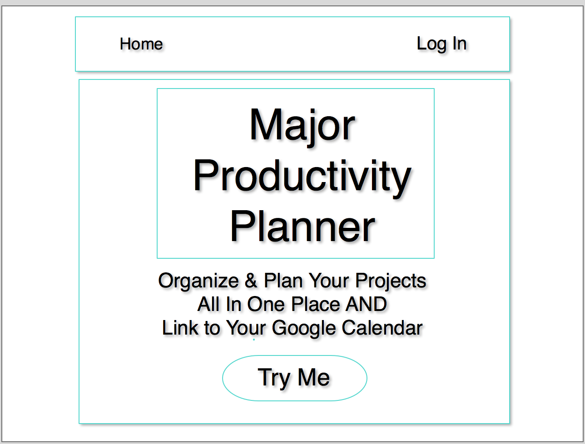
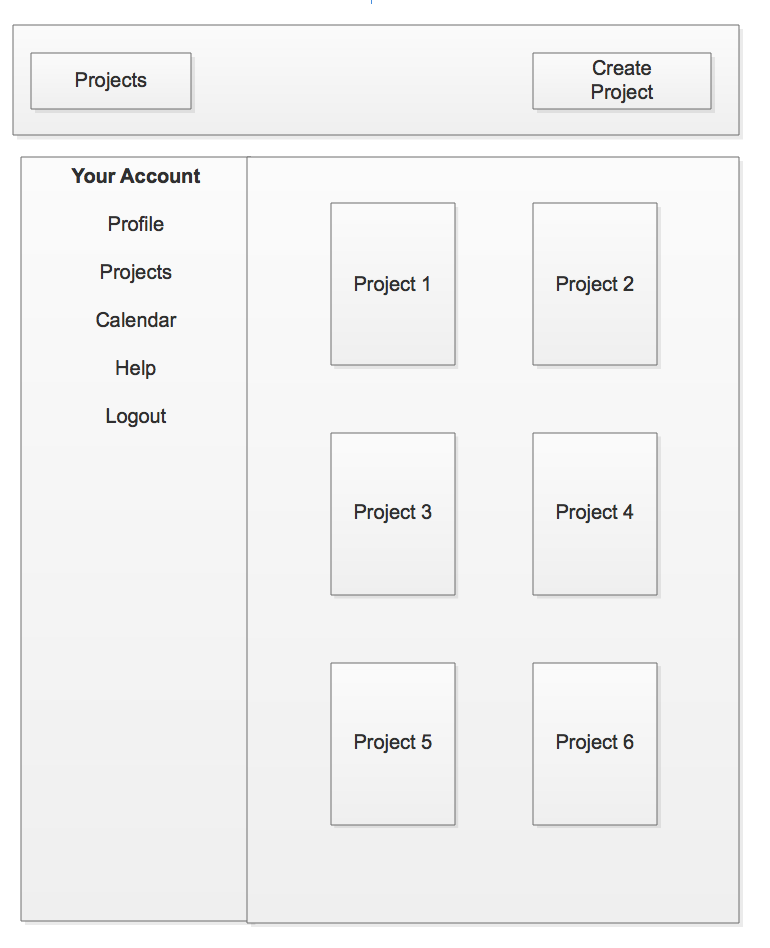
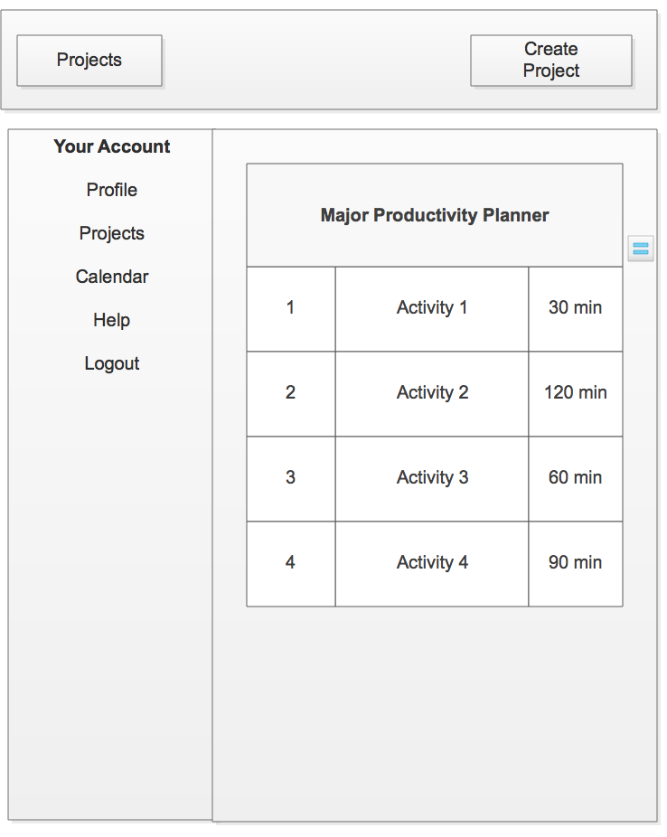
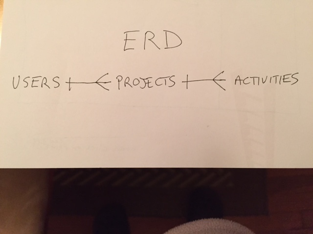

##Project 4 - Productivity Planner

**Created by** *Gaye Lowenstein*

####INTRODUCTION
Productivity Planner is an app where you can create, edit, store and delete your projects. The app allows you to create and prioritize specific activities and attach the time it will take to complete each activity. You can link these to your Google calendar so that you can plan out your day, week and month. Once complete, the projects can be stored for future reference.

####APPROACH TAKEN
This App was made with the Ruby on Rails framework and Postgresql for the database. The App will connect to the Google Calendar API and will use Google OAuth for user authentication and authorization.

####MVP
The MVPs for this project are:

* Allow users to create an account
* Allow users to create, edit, store & delete multiple projects
* Allow users to create, edit & delete activities within each project
* Allow users to update activities as they are completed

####TECHNOLOGIES USED

Technology  |  Purpose
----------  | ---------
Ruby on Rails | Full-stack web application framework     
PostgreSQL  | Relational database to store information
Bootstrap   | Responsive CSS framework for styling
Javascript  | Programming language that creates interactivity
HTML5       | Markup language used for structuring and presenting content
CSS3        | Style sheet language used for styling web content

####LINKS & WIREFRAMES

#####Trello Board
[Link to Trello Board](https://trello.com/b/3jzS8p46/project-4-major-productivity-planner)

#####Wireframes

#####ERD

####INSTALLATION INSTRUCTIONS
Go to Github Project Page - https://github.com/glowen18/p4_ruby_app
Click on this Online Link to get to Productivity Planner - https://p4rubyapp.herokuapp.com/
Create a Productivity Planner and Enjoy!

####UNSOLVED PROBLEMS

* Logout link not working
* User profile page not setup as a link
* Need a navbar with links to all different pages
* Styling still needs to be done on most pages

####STRETCH GOALS

* Incorporate testing into my project
* Allow users to create teams and delegate tasks to team members
* Have a Google OAuth for users to securely login and logoff
* Allow users to connect their activities to Google Calendar
